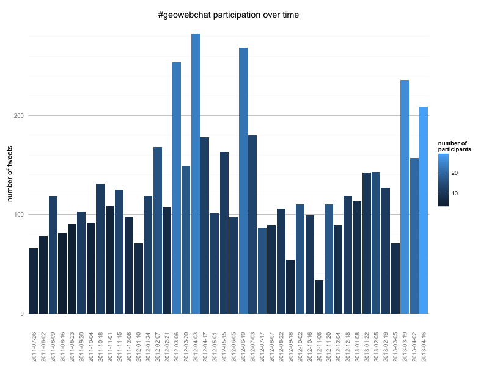
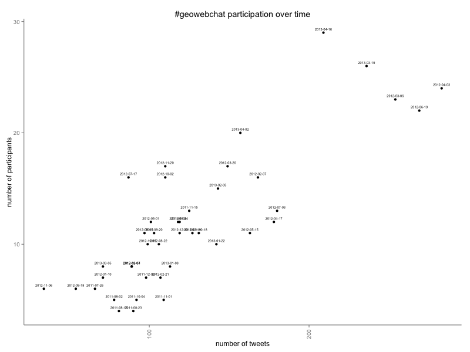
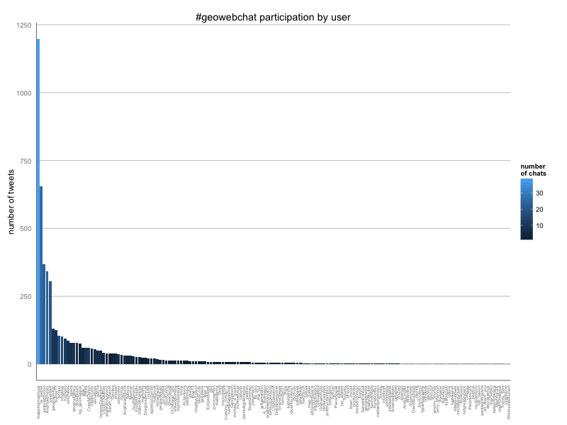
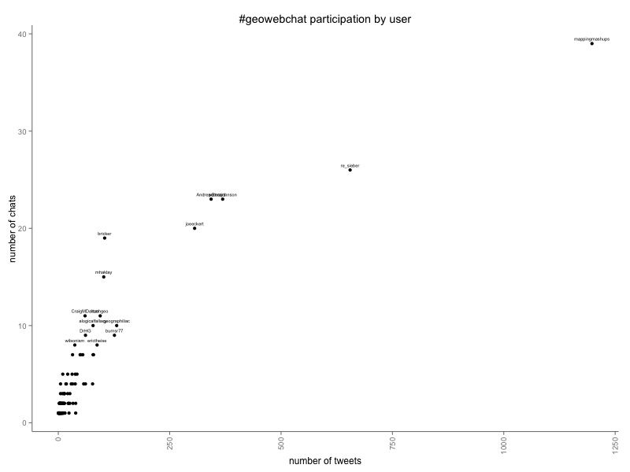

twitter_transcripts
===================

Tools for processing twitter transcripts.
**Warning: these scripts are awful and ugly, so if you can possibly use anything else, please do so.**

## Workflow:

### For each transcript: 

Load up the conversation in [Hootsuite Dashboard](https://hootsuite.com/dashboard/), select all the tweets you want to archive, and then view the source of this selection. Save the HTML source to a file. These scripts assume the specific HTML format used by Hootsuite, so they won't work if you copy HTML from any other twitter viewer, such as twitter.com.

Then, pipe this saved html file to the process_hootsuite.py script like so:

`cat tweets_2013-01-01.html | ./process_hootsuite.py > clean_tweets_reversed_2013-01-01.html`
  
The resulting cleaned an reversed html is suitable for posting on the web, or pasting into an existing html document.

However, you will still want to visually inspect this file. It's possible that not all of the tweets were parsed correctly. In particular, look for any links that are missing their closing `</a>` tag 

If that's all you want to do, you're done. But if you want to use the transcript analysis tools, continue on:

### For all transcript files:

`./tweet_stats.py clean_tweets_reversed_*.html | ./user_stats.py > output.tsv`

Detailed explanation of steps:

1. Copy html source of tweets from HootSuite Dashboard. 

2. Feed this html into process_hootsuite.py, which cleans up the HTML and reverses the chronological order.
 
3. Feed all of the cleaned-up html files into tweet_stats.py (which extracts username, date, and timestamp for each tweet)

4. Pipe the output of tweet_stats.py into user_stats.py (which counts number of tweets for each date and user and outputs tsv)

5. Generate charts using transcript_charts.R and the tsv output of user_stats.py

Example R output:

